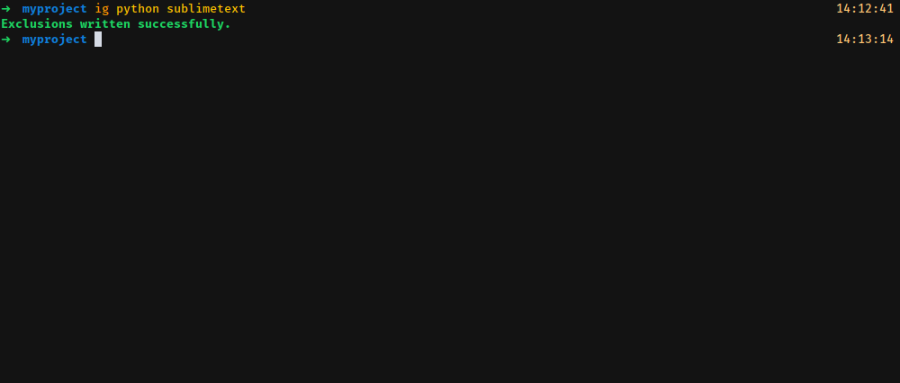

# Ignorio
     

**Ignorio** is a simple package to manage your [git exclusions](https://git-scm.com/docs/gitignore). This command line application helps you to download a template from [gitignore.io](http://gitignore.io/) without going to the site using the site's [API](https://www.gitignore.io/api/) 

# Usage

## Add a language exclusion list
* You can add multiple languages to the exclusions list, just make sure they're listed on the supported list.

## Append a language to the exclusion list
* You don't have to overwrite your current exclusion list, if you have added Python and SublimeText before then you can go right ahead and append Ruby to it.

## Show supported languages
* Supported list of languages by gitignore.io, you can easily grep this data if you need to find a determined language.

## Verbose for the paranoids
* And if you're paranoid enough or just like to see more data displayed on your terminal, well, check the `-v` flag.

# How to contribute
* Fork it
* Make changes
* Make a pull request to the **develop** branch.

# Like the project?
If you like the project and would like to chip in a dolar or two, go ahead and do it here.

  
